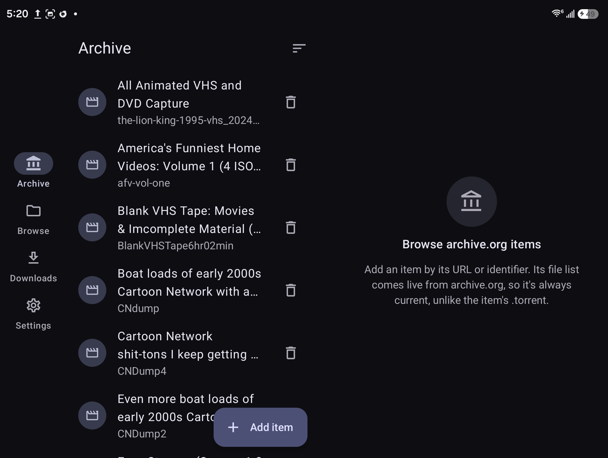

# Rewind

Browse archive.org items and `.torrent` files as if they were folders, then download or stream
just the file you want.



## Features

### Archive.org
- Add items by pasting a URL (`archive.org/details/…`, `/download/…`) or a bare identifier, or
  share a link to Rewind from your browser.
- File lists come live from the archive.org metadata API, so they're always current. The
  `.torrent` files archive.org generates often aren't.
- **Originals / Derivatives / Metadata** filter chips. The default is originals only, which hides
  the transcoded `.ia.mp4` copies that double the list.
- Per file: **Download**, **Download & stream**, or **Stream without downloading**. Players get
  the archive.org URL directly.
- Downloads resume where they left off (`.part` files and HTTP range requests).

### Torrents
- Browse the device's storage and tap a `.torrent` to open it as a folder. Other apps can hand
  `.torrent` files to Rewind too.
- Downloading one file sets every other file in the torrent to skip.
- **Download & stream** downloads sequentially and serves the file over a local loopback HTTP
  server. Reads block until the pieces arrive, and seeking in the player moves the download to
  the new position.
- Web seeds (BEP 19 `url-list`) work, including HTTPS ones (see [Notes](#notes)).
- Finished torrents are removed from the session. Rewind downloads; it doesn't seed.

### Everywhere
- Files are saved to `<download folder>/<torrent or item name>/<path inside it>`. archive.org's
  own torrents use the item identifier as their folder name, so both routes put files in the same
  place.
- Finished downloads open from local storage. Streams go to the video or audio player you picked
  the first time; Rewind remembers one of each, and you can reset them in Settings.
- Material 3 with dynamic color. Adaptive layouts: a bottom bar on phones; on tablets and
  unfolded foldables, a navigation rail with list and detail side by side, split along the hinge.
- One foreground notification shows progress for both kinds of download.

## Install

Rewind isn't on the Play Store; it uses all-files access (`MANAGE_EXTERNAL_STORAGE`) to browse
storage and write downloads. Download the signed APK from
[Releases](https://github.com/parkerlreed/rewind-player/releases) and open it on the device, or:

```sh
adb install -r Rewind-0.1.0.apk
```

Release APKs and your own debug builds are signed with different keys, so one can't update over
the other. Uninstall first when switching; export your Archive list in Settings beforehand and
import it afterwards.

On first launch Rewind sends you to the *All files access* settings screen. If your device
doesn't have that screen (for example some headsets), grant it over adb:

```sh
adb shell appops set dev.parker.rewind MANAGE_EXTERNAL_STORAGE allow
```

Requires Android 11 (API 30) or newer.

## Building

Needs the Android SDK (compileSdk 37) and a full JDK 17+ with `javac`; a JRE isn't enough.

```sh
./gradlew assembleDebug        # app/build/outputs/apk/debug/app-debug.apk
./gradlew assembleRelease      # signed if RELEASE_* signing properties are set, otherwise unsigned
./gradlew testDebugUnitTest    # bencode/torrent and archive.org parser tests
```

If your default Java is a JRE, point Gradle at a JDK, e.g.
`JAVA_HOME=/usr/lib/jvm/java-26-openjdk ./gradlew assembleDebug`.

## Project layout

| Path | What's there |
|---|---|
| `torrent/` | Bencode decoder and `.torrent` → folder tree (v1, v2 and hybrid) |
| `archive/` | archive.org metadata client, file classification, Archive tab state |
| `engine/TorrentEngine.kt` | libtorrent session, per-file priorities, streaming piece deadlines |
| `engine/StreamServer.kt` | Loopback HTTP server with range support for streaming torrents |
| `engine/HttpDownloader.kt` | Resumable HTTPS downloads for archive.org |
| `engine/Downloads.kt` | Shared job list for both engines |
| `engine/DownloadService.kt` | Foreground service and progress notification |
| `ui/` | Compose screens: Archive, Browse, Downloads, Settings |

## Notes

A few libtorrent4j quirks Rewind works around:

- **Web seeds are dropped.** libtorrent4j doesn't carry a torrent's `url-list` over when adding
  it, so Rewind parses `url-list` itself and calls `addUrlSeed` for each entry.
- **HTTPS has no trusted CAs on Android.** The statically linked OpenSSL looks for certificates
  in a path on libtorrent4j's CI machine. At startup Rewind exports Android's CA store to a PEM
  bundle and points `SSL_CERT_FILE` at it, so certificate verification stays on.

## License

GPL-3.0; see [LICENSE](LICENSE). Uses [libtorrent](https://libtorrent.org) through
[libtorrent4j](https://github.com/aldenml/libtorrent4j) (MIT), and the public
[archive.org metadata API](https://archive.org/developers/md-read.html).
